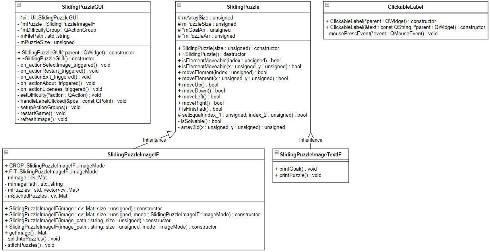

# QT PUZZLE

QT PUZZLE is a sliding puzzle game in which you have to move puzzles to get an original picture, with QT-based GUI. This game was made as a project for Advanced Programing Techniques course in Warsaw University of Technology.

## How to start

### Prerequisites

Before building please install these packages:

```
sudo apt install build-essential cmake qtbase5-dev libopencv-dev
```

### How to build

To build, run these commands from the qt_puzzle directory

```
mkdir build
cd build
cmake ..
make -j4
```

### How to run

Three executables will be build:

  * text_puzzle: puzzke with a simple terminal interface, controled using WSAD buttons
  * cv_puzzle: puzzle with a GUI based on OpenCV, controled using WSAD buttons
  * qt_puzzle: main program, GUI based on QT, controled using mouse

All of them should be started from qt_puzzle/build directory:

```
# From qt_puzzle/build dir

# To start text_puzzle
# Argument PUZZLE_SIZE is s a number bigger or equal 3, that specifies the puzzle size
./text_puzzle PUZZLE_SIZE

# To start cv_puzzle
./cv_puzzle

# To start qt_puzzle

./qt_puzzle

```
## Class diagram



